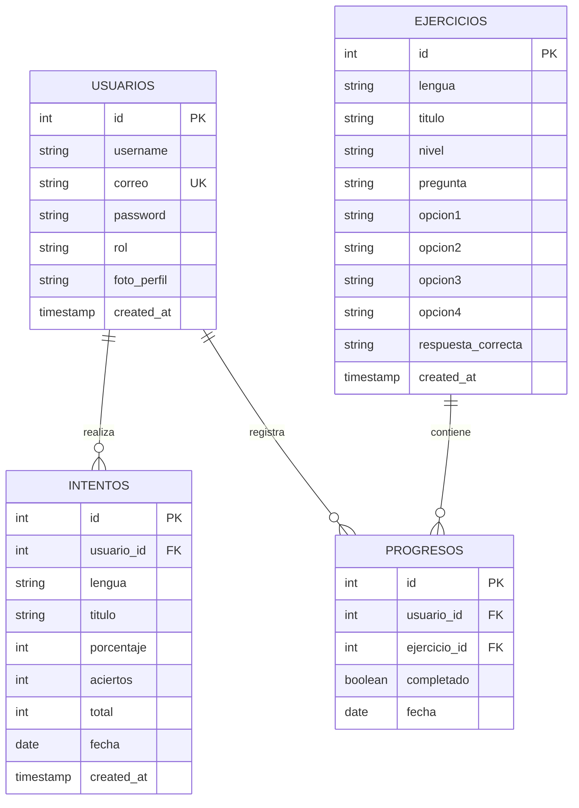
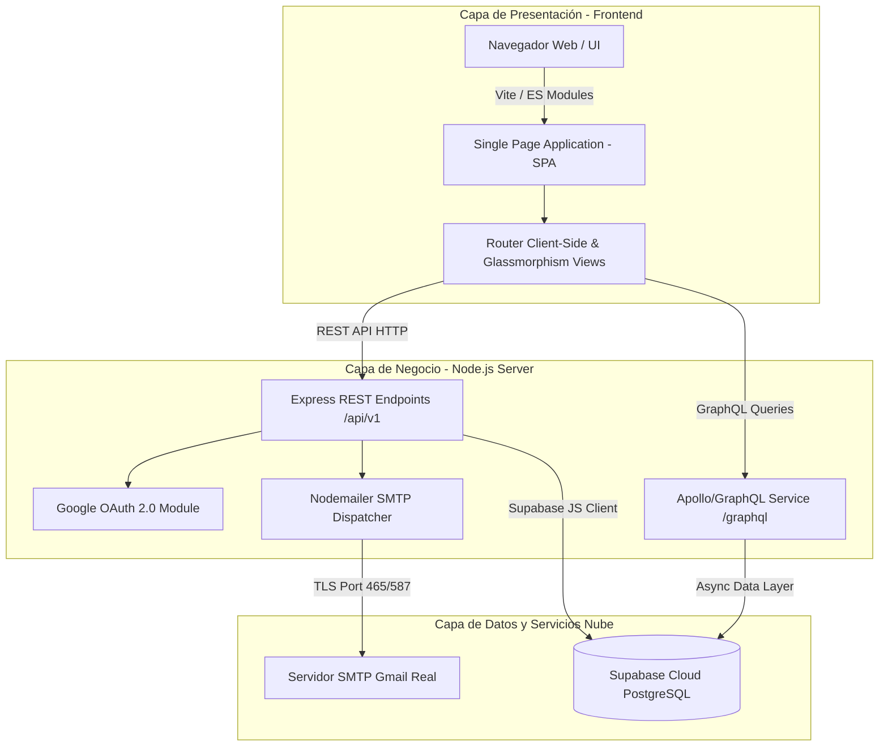

#  DOCUMENTACIÓN TÉCNICA — YAK

---

## 1. Requerimientos Mínimos y Recomendados de Hardware

###  Cliente (Usuario Final / Navegador Web)
| Componente | Requerimiento Mínimo | Requerimiento Recomendado (Óptimo) |
| :--- | :--- | :--- |
| **Procesador** | Dual Core 1.6 GHz (Intel Celeron / ARM Cortex A53) | Quad Core 2.0 GHz o superior (Intel Core i3 / M1 / Snapdragon 600+) |
| **Memoria RAM** | 2 GB RAM | 4 GB RAM o superior |
| **Almacenamiento** | 100 MB de espacio disponible en disco/memoria interna | 500 MB de espacio libre |
| **Pantalla / Resolución** | 360 x 640 px (Dispositivos móviles) | 1920 x 1080 px (Pantalla Full HD) |
| **Conexión a Red** | Conexión a Internet 2 Mbps | Conexión de Banda Ancha 10 Mbps o superior |

###  Servidor de Aplicación (Node.js Backend & Supabase Cloud)
| Componente | Requerimiento Mínimo | Requerimiento Recomendado (Producción) |
| :--- | :--- | :--- |
| **Procesador (vCPU)** | 1 vCPU (0.5 GHz) | 2 vCPU o superior |
| **Memoria RAM** | 512 MB RAM | 2 GB RAM o superior |
| **Base de Datos** | Supabase Cloud PostgreSQL (Free Tier 500 MB) | Supabase Pro / PostgreSQL Dedicated |
| **Ancho de Banda** | 10 GB mensual | 50 GB+ mensual |

---

## 2. Requerimientos Mínimos y Recomendados de Software

###  Cliente
- **Sistema Operativo**: Windows 10/11, macOS 10.15+, Linux, Android 8.0+, iOS 13.0+.
- **Navegadores Compatibles**: Google Chrome, Microsoft Edge, Apple Safari.

###  Servidor y Entorno de Desarrollo
- **Entorno de Ejecución**: Node.js v18.0.0 o superior (v24.x recomendado).
- **Gestor de Paquetes**: NPM v9.0.0+.
- **Motor de Base de Datos**: PostgreSQL 15+ (alojado en **Supabase Cloud**).
- **Protocolos y APIs**: REST API HTTP/1.1, GraphQL v16+, SMTP (Nodemailer con Gmail App Password).
- **Control de Versiones**: Git 2.30+.

---

## 3. Casos de Uso

| ID | Caso de Uso | Actor | Descripción |
| :--- | :--- | :--- | :--- |
| **CU-01** | Registro de Usuario | Usuario Visitante | Creación de cuenta con correo, usuario y contraseña. |
| **CU-02** | Inicio de Sesión | Usuario Registrado | Autenticación local o vía Google OAuth 2.0. |
| **CU-03** | Recuperación de Contraseña | Usuario Registrado | Envío de PIN de 6 dígitos a Gmail real para restaurar la clave. |
| **CU-04** | Explorar Catálogo y Cursos | Usuario Autenticado | Consulta de lecciones y módulos de Chol, Yokot'an y LSM. |
| **CU-05** | Realizar Quiz e Incrementar Racha | Usuario Autenticado | Evaluación con cálculo dinámico de racha (≥ 60% de aciertos). |
| **CU-06** | Edición de Perfil | Usuario Autenticado | Actualización de foto de perfil, usuario y correo. |

---

## 4. Historias de Usuario (User Stories)

###  HU-01: Registro de Cuenta
- **Como** usuario nuevo interesad@ en aprender lenguas originarias,
- **Quiero** registrarme ingresando mi nombre de usuario, correo y contraseña,
- **Para** guardar mi progreso, estadísticas y días en racha.
- **Criterios de Aceptación**:
  - El correo no debe estar duplicado.
  - La contraseña debe ser procesada de forma segura.
  - Al completar el registro, se redirige automáticamente al inicio de sesión.

###  HU-02: Autenticación Social con Google
- **Como** usuario registrado en Google,
- **Quiero** iniciar sesión con 1 solo clic mediante el botón oficial de Google,
- **Para** acceder a la plataforma sin necesidad de recordar una contraseña local.
- **Criterios de Aceptación**:
  - Se integra Google Identity Services SDK v2.
  - Se conserva la foto de perfil y nombre de usuario al volver a ingresar.

###  HU-03: Sistema de Racha (≥ 60% de Aciertos)
- **Como** estudiante de lenguas originarias,
- **Quiero** que mi racha aumente solo cuando apruebe un quiz con al menos 60% de aciertos,
- **Para** motivarme a practicar y mantener el hábito de estudio diario.
- **Criterios de Aceptación**:
  - Si en un día no apruebo un quiz con ≥ 60%, la racha se marca como perdida por inactividad.
  - Al aprobar un nuevo quiz con ≥ 60%, la racha vuelve a activarse en 1 día.

---

## 5. Diagrama Entidad-Relación (E-R)



---

## 6. Diagrama de Arquitectura de Software



---

## 7. Diccionario de Datos

### 📑Tabla 1: `public.usuarios`
| Campo | Tipo de Dato | Llave | Nulo | Descripción |
| :--- | :--- | :--- | :--- | :--- |
| `id` | `SERIAL` | PK | NO | Identificador único del usuario |
| `username` | `TEXT` | - | NO | Nombre de usuario visible |
| `correo` | `TEXT` | UK | NO | Correo electrónico único |
| `password` | `TEXT` | - | NO | Contraseña cifrada / Hash OAuth |
| `rol` | `TEXT` | - | SÍ | Rol en el sistema (`USUARIO`, `OWNER`) |
| `foto_perfil` | `TEXT` | - | SÍ | URL o base64 de la imagen de perfil |
| `created_at` | `TIMESTAMPTZ`| - | NO | Fecha y hora de creación  |

###  Tabla 2: `public.ejercicios`
| Campo | Tipo de Dato | Llave | Nulo | Descripción |
| :--- | :--- | :--- | :--- | :--- |
| `id` | `INT` | PK | NO | Código de la pregunta (101-340) |
| `lengua` | `TEXT` | - | NO | Lengua originaria (`Chol`, `Maya`, `LSM`) |
| `titulo` | `TEXT` | - | NO | Nombre del módulo / tema académico |
| `nivel` | `TEXT` | - | NO | Dificultad (`Básico`, `Intermedio`) |
| `pregunta` | `TEXT` | - | NO | Texto de la pregunta del quiz |
| `opcion1` | `TEXT` | - | NO | Opción de respuesta A |
| `opcion2` | `TEXT` | - | NO | Opción de respuesta B |
| `opcion3` | `TEXT` | - | NO | Opción de respuesta C |
| `opcion4` | `TEXT` | - | NO | Opción de respuesta D |
| `respuesta_correcta`| `TEXT` | - | NO | Opción válida esperada |

###  Tabla 3: `public.intentos`
| Campo | Tipo de Dato | Llave | Nulo | Descripción |
| :--- | :--- | :--- | :--- | :--- |
| `id` | `SERIAL` | PK | NO | Identificador del intento |
| `usuario_id` | `INT` | FK | NO | Referencia al usuario (`usuarios.id`) |
| `lengua` | `TEXT` | - | NO | Lengua evaluada |
| `titulo` | `TEXT` | - | NO | Tema presentado |
| `porcentaje` | `INT` | - | NO | Porcentaje de aciertos (0-100%) |
| `aciertos` | `INT` | - | NO | Número de respuestas correctas |
| `total` | `INT` | - | NO | Total de preguntas formuladas |
| `fecha` | `DATE` | - | NO | Fecha del intento (`YYYY-MM-DD`) |

---

## 8. Mockups y Diseño UX Terminadas

- **Aesthetica & UI**: Minimalista moderno con sdiferentes colores por lengua (Verde Emerald para Chol `#10B981`, Azul Royal para Yokot'an `#3B82F6`, Morado  para LSM `#8B5CF6`).
- **Navegación**: Sidebar lateral dinámico y topbar fija.
- **Micro-Animaciones**: Transiciones de entrada en botones, tarjetas de lección con respuestas interactivas.

---

## 9. Módulos Completados

1. **Módulo de Registro e Inicio de Sesión**:
   - Registro con validación de correo único.
   - Autenticación por Correo o Nombre de Usuario.
   - Botón oficial con **Google Identity Services OAuth 2.0**.
2. **Módulo de Recuperación de Contraseña por Correo**:
   - Generación de PIN aleatorio de 6 dígitos.
   - Despacho de correo HTML estilizado vía **Nodemailer SMTP Gmail** (`yakplataform@gmail.com`).
   - Verificación de PIN en 3 pasos antes de actualizar clave.
3. **Módulo de Evaluación e Inteligencia de Racha**:
   - 120 preguntas oficiales cargadas en Supabase PostgreSQL.
   - Algoritmo de cálculo dinámico de racha en tiempo real: activa en ≥60% y pérdida automática por inactividad.
4. **Módulo de Gestión de Perfil**:
   - Cambio de foto de perfil y nombre de usuario con persistencia en Supabase Cloud.

---

## 10. Pruebas Unitarias y de Integración (Evidencia de Ejecución)

### Prueba 1: Conexión y Consulta Directa a Supabase Cloud
```bash
> node -e "require('dotenv').config(); const { supabase } = require('./src/backend/supabaseClient'); async function t(){ const { data, error } = await supabase.from('ejercicios').select('*'); console.log('SUPABASE COUNT:', data.length, 'ERROR:', error); } t();"

 Conectado exitosamente a Supabase PostgreSQL Cloud
SUPABASE COUNT: 120 ERROR: null
```

###  Prueba 2: Cálculo Dinámico de Racha (≥ 60% Aciertos)
```bash
> node -e "async function t(){ await fetch('http://localhost:3000/api/v1/intentos', {method:'POST', headers:{'Content-Type':'application/json'}, body:JSON.stringify({usuarioId:2, lengua:'Chol', titulo:'General', porcentaje:80, aciertos:4, total:5})}); const r = await fetch('http://localhost:3000/api/v1/racha/2'); console.log(await r.json()); } t();"

{ usuarioId: 2, dias: 1, rachaActiva: true, rachaPerdida: false, ultimaFecha: '2026-07-27' }
```

###  Prueba 3: Consulta GraphQL Unificada
```bash
> node -e "async function t(){ const r = await fetch('http://localhost:3000/graphql', {method:'POST', headers:{'Content-Type':'application/json', 'x-api-key':'yak_secret_key_2026'}, body:JSON.stringify({query:'{ getEjercicios { id lengua titulo } }'})}); const d = await r.json(); console.log('GRAPHQL COUNT:', d.data.getEjercicios.length); } t();"

GRAPHQL COUNT: 120
```

---

## 11. Spec-Driven Development (SDD asistido por IA - LLM)

El proyecto **YAK Platform** fue desarrollado utilizando la metodología **Human-in-the-Loop (HITL)** apoyado por los agentes autónomos de IA de Google DeepMind (Google Antigravity SDK & AGY 2.0).

- **Ciclos de Especificación**:
  1. Definición formal de contratos API REST y esquemas GraphQL en `graphql.js`.
  2. Diseño de componentes modulares frontend acoplados al diseño Minimalista.
  3. Refactorización e integración continua con Supabase Cloud y Nodemailer.
- **Validación Continua**:
  - Cada componente editado fue verificado mediante scripts de integración automatizados antes de consolidar el release.
